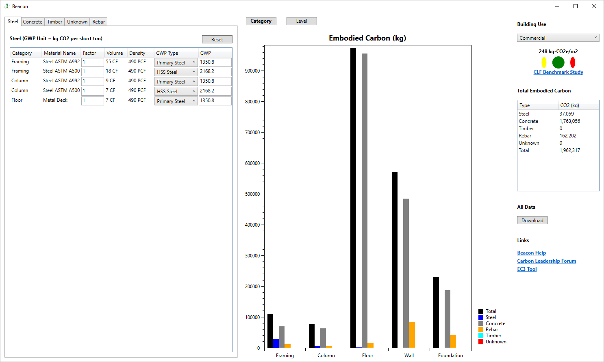

# Beacon
Beacon is a Revit plug-in for structural engineers that provides quick, high level feedback and clear data visualization of structural system's embodied carbon performance.

## Getting started
1. Download and run Beacon msi or download ZIP for manual install
   - [Get the current release](https://github.com/ThorntonTomasetti/Beacon/releases)
   - **IMPORTANT:** When installing via the install.bat file from the ZIP file, on some systems, the content of the ZIP file is blocked and the plugin will fail to run. To resolve, right click on the contents of C:\ProgramData\Autodesk\Revit\Addins\2018\Beacon (replace 2018 with Revit version), select **Properties**, and click on the **Unblock** button if it is present in the lower right hand corner of the **General** tab in the properties dialog.

2. Run Beacon plug-in under the Revit Add-ins tab

## How it works
Beacon converts Revit element volume and material density to an embodied carbon value based on a user specified GWP coefficient. For results to be accurate it is essential that all elements have a volume and have the right material and density assigned.

Elements belonging to the following Revit Categories are considered:
- Structural Framing
- Structural Columns
- Structural Foundation
- Floors
- Walls

The total embodied carbon per square meter of floor area is measured against median values for various building typologies (Commercial, Residential, Education, Health Care, Lodging, Mixed, etc) and rated red, yellow, or green. Those median values are from data provided to the [Carbon Leadership Forum](http://www.carbonleadershipforum.org/) since 2012 for the [Embodied Carbon Benchmark Study](http://www.carbonleadershipforum.org/projects/embodied-carbon-benchmark-study/). This tool will hopefully make embodied carbon part of an engineers design thought process and also allow them to share their data.

The EC takeoff is targeted for EC3 integration and SE 2050 metrics. Future development may include automated uploads to a central database and more detailed optimization strategies.  

## Documentation
[core-studio.gitbook.io/beacon](https://core-studio.gitbook.io/beacon/)

## Contribute
Help us make Beacon better.

Typical contribution flow:

1. Create issue (bug or new feature)
2. Wait for some feedback
3. Commit your changes
4. Create a pull request

### Reporting bugs

Please search existing issues for same/similar bug to prevent duplication. A bug report should include:

- The Revit version (2018, 2019, 2020 etc.)
- A description of the issue
- Expected and actual behavior

### Suggesting new features

Please search existing issues for same/similar feature to prevent duplication. A feature request should include:

- A description of the issue
- A sketch/drawing/image, if possible

### Branch

The branching model in use is described [here](https://nvie.com/posts/a-successful-git-branching-model/). The repository contains two branches:

- `master` - the production/release branch (stable code)
- `develop` - the branch containing the latest development changes (pre-release code)

Please base your work on the `develop` branch.

